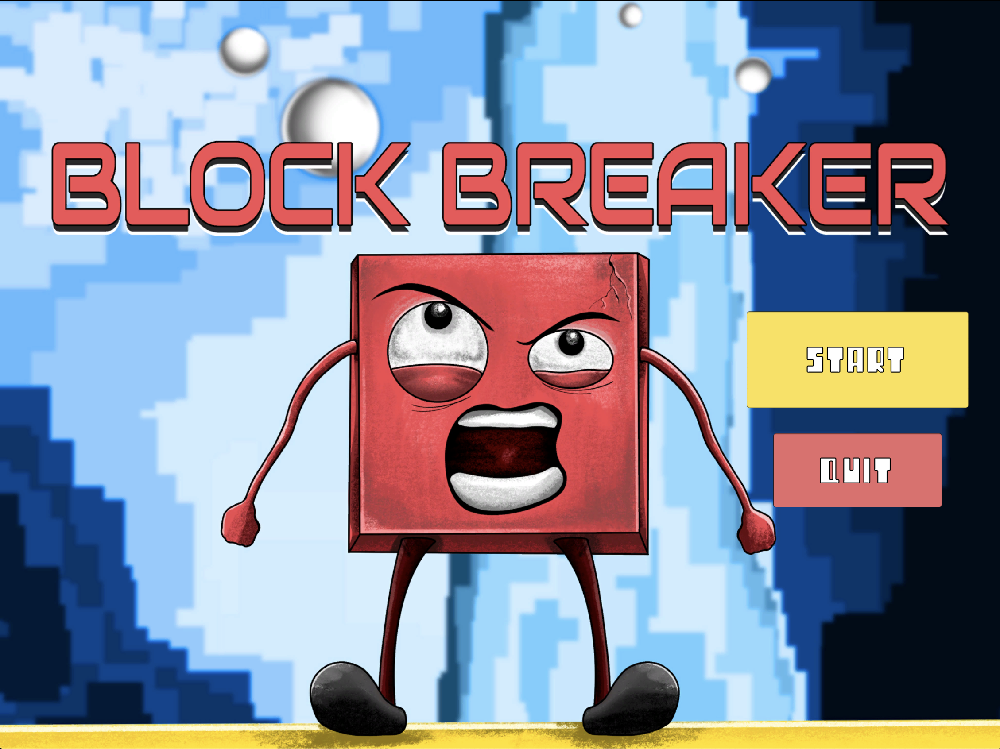
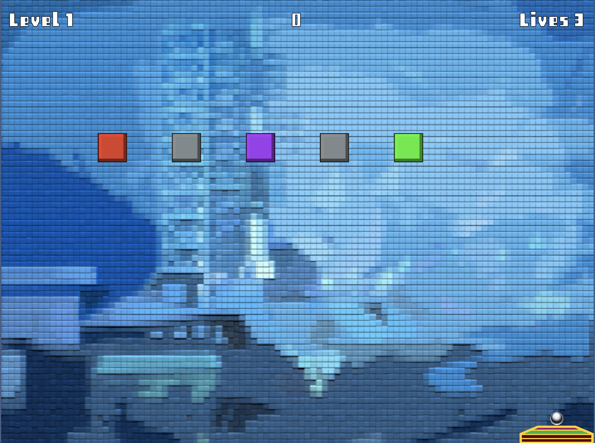

# Block Breaker
- Block Breaker is a Unity 2D developed game, where you try and continuously break blocks overhead with the provided ball.

## Game Pages and Functionalities:

**Main Menu**

*This is the Starting screen of the game, where you can either start or quit the game.*

---

**Gameplay Screen (Level 1)**

*This is the Gameplay screen, where you launch the ball at the blocks and keep the ball from falling in order to prevent Game Over.*  

---

**GameOver Screen**

*This is the Game Over screen, which comes when you run out of lives from keeping the ball alive.*

--- 
